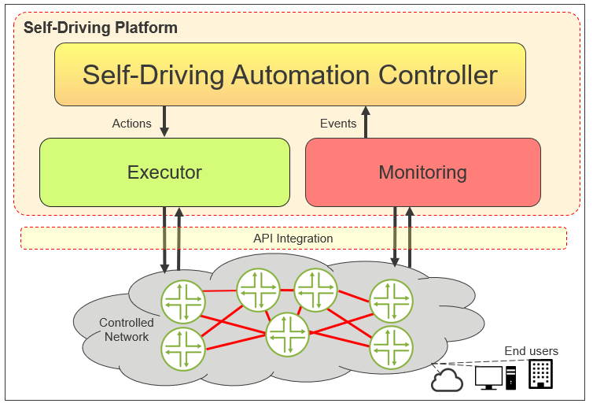
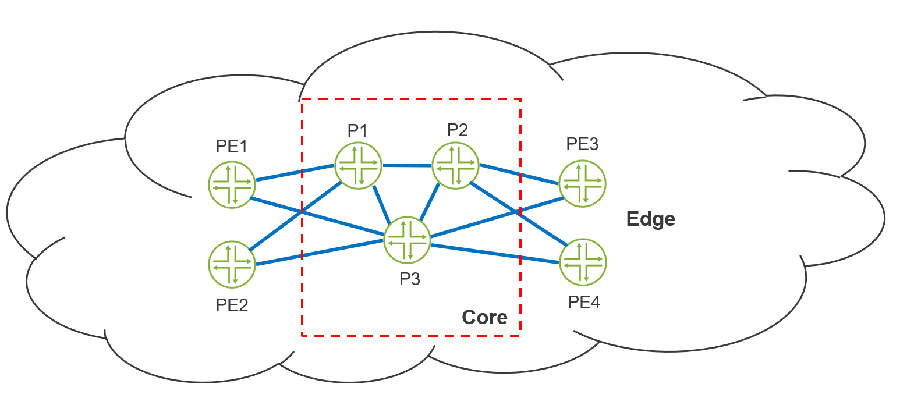
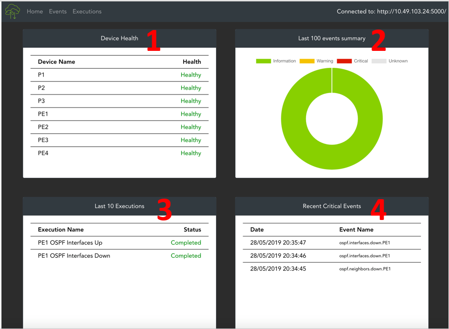
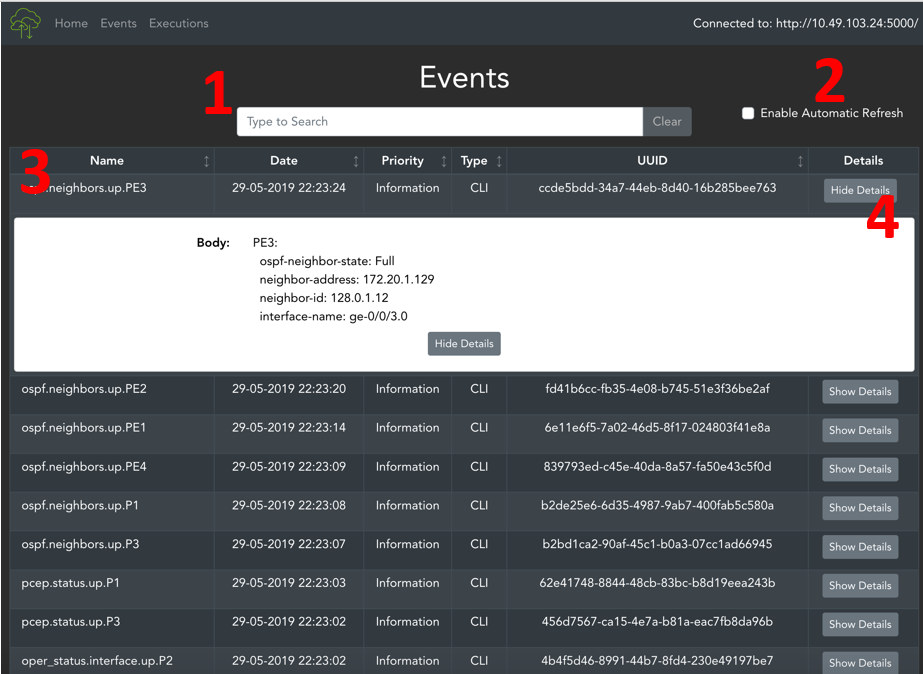
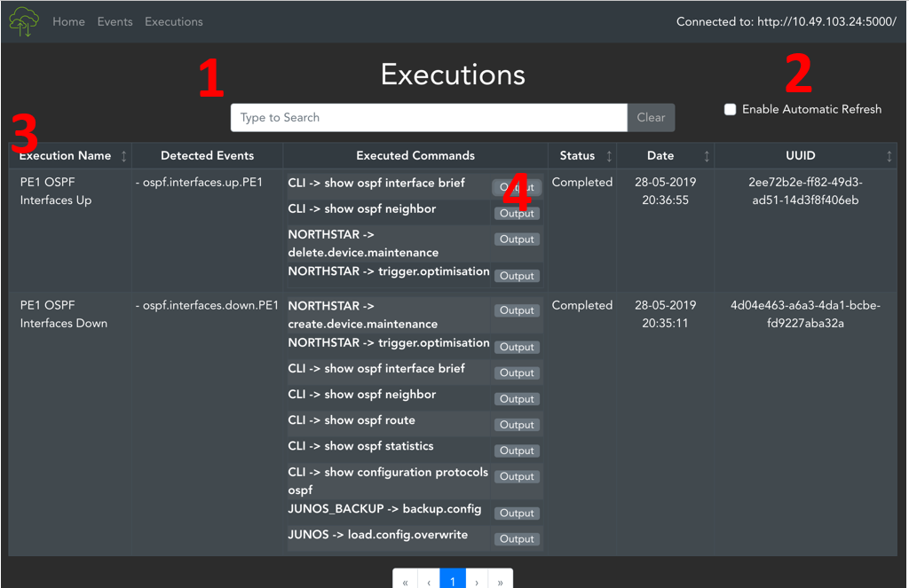
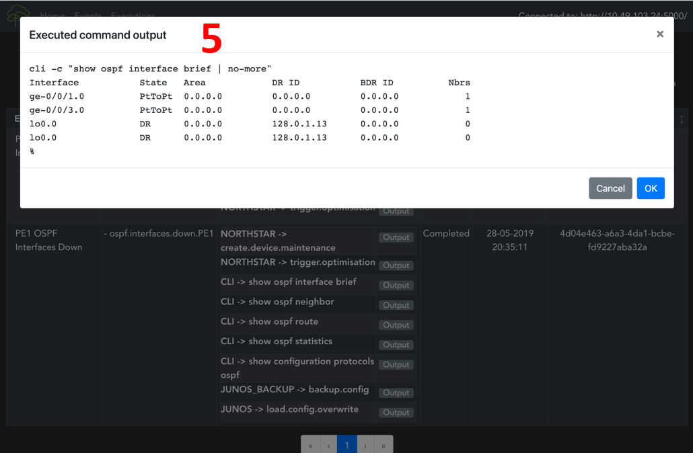

# CoreNet

## Summary

In modern society, telecommunications networks are still being operated manually or with basic automation. As demand for better speeds and reliability increases there is also a demand for better automation. We have built an automated network with self-driving capabilities to tackle this problem. Our aim is to be able to understand and explore the problems and complexities associate with network automation through the simple self-driving network we have built.

## Architecture

At a high-level we have implemented a microservices architecture for the main controller platform. The microservices architecture involves separating each function of the platform into their self-contained modules. For the modules to interact with each other, each module can utilise another modules’ RESTful API endpoint to send and receive data. The advantages of a microservices architecture compared to alternative architectures such as the classic monolithic architecture is that microservices can be scaled as needed. The underlying framework which is used to make the microservice is Flask, which is a micro web framework for building a web application.

Our platform is made of 5 microservices that are responsible for their own respective tasks. In a typical web application, the Collector, Database, Evaluator and Executor can be considered the “backend” which controls all logic of the platform and the Web UI is the “frontend” as it visualises the environment for the user.

- Collector: Responsible for monitoring all the data on the current state of every network device,
- Database: Handles the archiving of all data that is collected or processed for future use.
- Evaluator: Pulls data from the storage service and determines if any actions need to be taken.
- Executor: Called upon by the evaluation service for carrying any required actions to remediate the network.
- Web UI: Web interface for which the end user can monitor the status of the self-driving network

## Network

To test our Self-diving platform, we have simulated a network topology that might look like a basic Internet Service Provider (ISP) Network. The network is made up of 3 core routers and 4 edge routers. Core routers are typically found in the backbone of an ISP network, they provide connectivity between edge routers and will need a large amount of bandwidth and processing power to move traffic. Edge routers will bridge the connection between an end user and the ISP network and will be able to put packets into the core network without knowing how to reach the destination.

## Frontend

To complement the self-driving platform, a Web UI was built to visualise how the platform was behaving and under the current health status of each device. The dashboard was designed to be quite simple using the Vue.js framework as it is easy to get a web page working quickly this is combined with the bootstrap framework which enables a pleasant visual design. Presently the dashboard has 3 pages, the homepage, events and finally the executions page. These were identified as the key points in which it would be nice to view the information. Data is retrieved from using the Database services RESTful API entry-points and loaded onto the page.

1.	Easy way to spot if the network devices are health. If any critical events have occurred in the past 100 events, a device is considered “Unhealthy”
2.	Pie chart of the last 100 events
3.	Lists the 10 most recent executions and if they were successful
4.	Lists the 10 most recent Critical Events that occurred on the platform

1.	Search bar to filter the events table below
2.	Toggles the automatic refresh, which periodically update the events table
3.	Table which retrieves that last 100 events that have occurred
4.	Toggle switch which displays extra information on the event

1.	Search bar to filter the events table below
2.	Toggles the automatic refresh, which periodically update the events table
3.	Table which retrieves that last 50 events that have occurred
4.	Toggle which will show the logging of the execution
5.	Each executed command will have logging available that can be viewed in the browser

## Features

- Integration with AppFormix
- Integration with Contrail Healthbot (formerly AppFormix Healthbot)
- Integration with NorthStar
